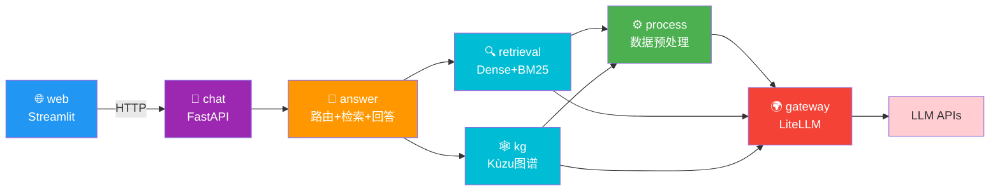
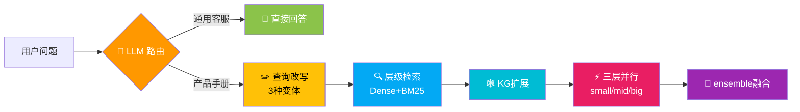
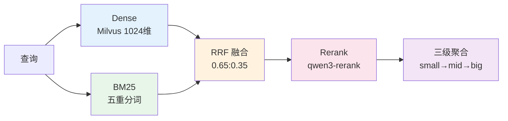
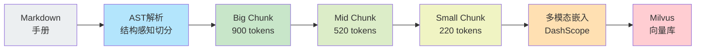
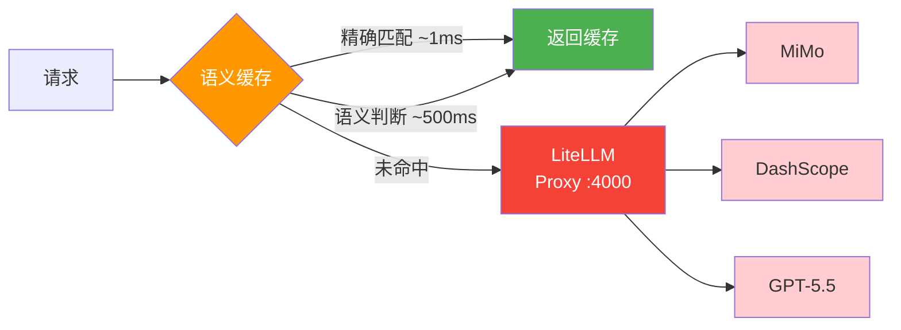
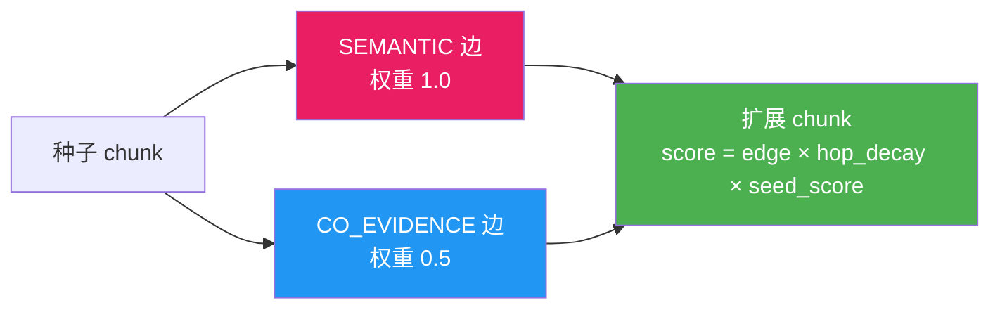
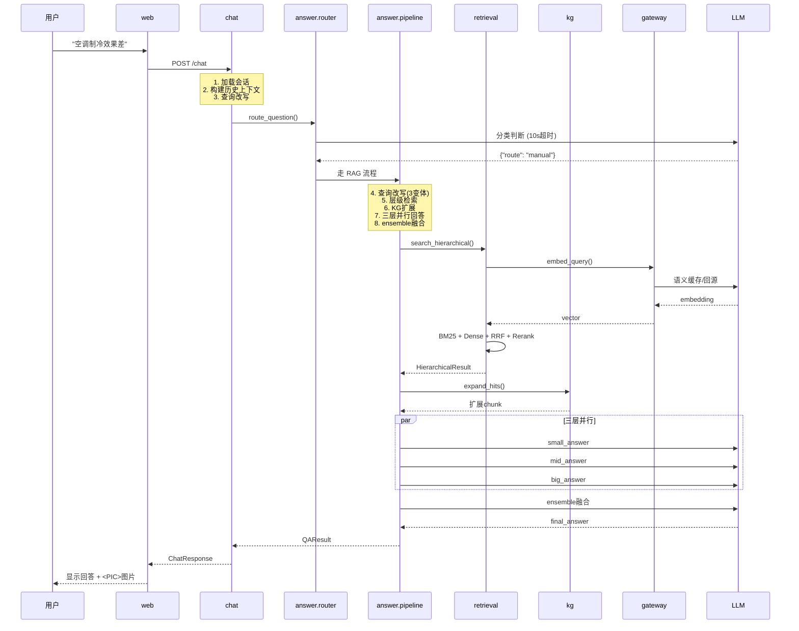

# InterX 技术文档

基于产品手册的智能客服系统 — 技术架构与核心实现方案

---

## 一、系统概述与核心痛点

| 痛点 | 表现 | 传统方案局限 |
|------|------|------------|
| **数据质量差** | 赛题无结构化文件、图文不匹配、OCR 残留、页眉错乱 | 直接使用脏数据，检索和回答质量无法保障 |
| **检索精度不足** | "化油器怎么调" vs "化油器调节螺钉位于……"，关键词不匹配 | 纯 BM25 依赖字面匹配，Dense 向量平滑掉精确术语 |
| **幻觉风险高** | LLM 编造操作步骤，产品安全相关错误后果严重 | 单次生成无校验机制 |
| **跨章节推理困难** | "制冷差"的原因在故障排查章节，解决方案在维护保养章节 | 首跳检索仅命中单一章节 |
| **通用问题混入** | 用户问退货/物流政策，RAG 返回"手册中未找到" | 所有问题都走 RAG，无路由分流 |
| **多轮上下文丢失** | "那个按钮在哪？""按了没反应怎么办？"，代词指代消解失败 | 简单拼接历史，LLM 误解指代对象 |
| **系统延迟高** | 多层 LLM 调用（检索+回答+改写）导致端到端延迟数十秒 | 无缓存、无并行、无降级 |

---

## 二、系统架构

#### 📐 整体分层



#### 🔀 answer 管道内部



#### 🔍 retrieval 内部



#### ⚙️ process 管线



#### 🌍 gateway 架构



#### 🕸️ kg 知识图谱



</details>

<details>
<summary><b>🔄 数据流全景（点击展开）</b></summary>



</details>

---

## 三、各包核心技术实现

### 3.1 process — 数据预处理层

#### 3.1.1 三层数据清洗体系

**痛点：** 赛题原始数据无结构化文件、图文不匹配、OCR 残留伪影、页眉错乱

**方案：** 构建三层递进的数据清洗体系

**第一层 — 文本规范化清洗：**
- 移除 BOM 字符、连续空格合并、过多换行压缩
- 所有输入无条件经过此层清洗

**第二层 — AST 结构重建清洗：**
- 基于 `markdown-it` 的 CommonMark 解析器将 Markdown 转为 AST
- 表格重建为标准管道分隔格式，行数不均时填充空列
- 列表递归渲染保留嵌套缩进，代码块保留围栏标记
- 同时维护原始 Markdown 和纯文本**双表示**

**第三层 — AI Agent 语义审计清洗（Manual Image/Text Audit Skill）：**

```
逐手册 9 步审计流程:
  1. 读取完整 Markdown + 标题大纲
  2. extract_image_context.py → 每张图片的最近标题 + 前后文本
  3. make_contact_sheet.py → 缩略图总览（220x160, 3列布局）
  4. 逐张视觉检查
  5. 识别六类错配模式（注释错位、页眉误识别、裁剪图片等）
  6. 非破坏性修复
  7. 用户确认边界（删除/替换/改写前必须询问）
  8. 验证（图片引用完整性、链接可解析性、标题连贯性）
  9. 总结修复和未解决问题
```

辅助工具：`ocr-patterns.md` OCR 残留模式库（缺空格、拆分词、粘连单位），分"可安全修复"和"需先询问"两类。

**效果：** 已完成 40 本中英文手册、约 3400+ 张图片的全面审计，修复大量图文错配和 OCR 伪影。

#### 3.1.2 结构感知的三级分块

**痛点：** 传统 RAG 使用固定 token 窗口切分，破坏操作步骤语义完整性

**方案：** 按 Markdown 元素类型差异化切分 + 三级层次构建

| 元素类型 | 切分策略 |
|---------|---------|
| 段落 | 句子边界切分（`.!?。！？;；`） |
| 列表 | 列表项边界切分，保留缩进 |
| 表格 | 数据行切分，每个片段重复表头 |
| 代码块 | 保留围栏标记到每个片段 |

**图片"粘性"算法：** 贪心打包时，图片元素不触发 flush 操作，确保图片始终与解释文字在同一 chunk 中。

| 层级 | Token 目标 | 语义定位 |
|------|-----------|---------|
| Big | 900 | 完整章节、背景概述 |
| Mid | 520 | 操作流程、多步骤指南 |
| Small | 220 | 精确事实、型号、安全约束 |

**关键设计：**
- **标题只注入首个 chunk：** 避免重复标题浪费 token
- **Overlap 机制：** 超限元素拆分时带重叠窗口，防止步骤断裂
- **层次化 Prefix 注入：** 每个 chunk 的 `retrieval_text` 包含完整父链前缀（"手册 > 章节 > 大块 > 中块 > 小块"），检索时自动携带结构化上下文
- **content_hash 增量重建：** 每个 chunk 计算 MD5，下游跳过未变更 chunk

#### 3.1.3 多模态统一向量空间

**痛点：** 图片在 RAG 中被丢弃，用户上传图片无法参与检索

**方案：** DashScope `qwen3-vl-embedding` 模型将文本和图片编码到同一 1024 维向量空间

- 每个 small chunk 最多关联 1 张图片作为"视觉锚点"
- 用户上传图片时，查询向量与 chunk 向量在同一空间比较
- 基于 `content_hash` 的增量嵌入：内容未变则复用缓存向量

#### 3.1.4 构建质量保障

- **Token 分布统计：** min/max/avg/p50/p90
- **缺失图片检测：** 构建阶段检查图片引用是否断裂
- **异常检测：** big/mid/small 任一数量为 0 时标记异常
- **构建报告自动生成 Markdown 表格**

---

### 3.2 retrieval — 多通道混合检索层

#### 3.2.1 五重分词策略

**痛点：** 纯 jieba 分词将产品型号（"DCD791"）错误切分，专业术语被拆散

**方案：** 五重分词叠加，同时在多个粒度构建检索信号

```
原始文本 → 层1 ASCII Token（英文/数字）
         → 层2 Jieba 中文分词（语义词汇）
         → 层3 中文单字符（Unigram 回退）
         → 层4 Bigram（相邻二字组合）
         → 层5 Trigram（相邻三字组合）
         → BM25Okapi 索引
```

**效果：** 产品型号通过 ASCII Token 精确匹配，专业术语通过 bigram/trigram 兜底，分词错误不再导致召回失败。

#### 3.2.2 双通道召回 + RRF 融合

**痛点：** Dense 向量平滑掉精确术语，BM25 无法处理同义表达

**方案：** Dense（权重 0.65）+ BM25（权重 0.35），通过 RRF 基于排名融合

- **Instruct-Embedding：** 查询端使用 `query_prompt` 前缀，文档端使用 `document_prompt` 前缀，引导模型在不同语义子空间表示
- **召回过生成：** 两通道各召回 20 个，融合后保留 20 个给 Rerank
- **BM25 分数过滤：** 显式过滤 `score ≤ 0` 的噪声结果

#### 3.2.3 领域特化 Rerank

**痛点：** 通用 Rerank prompt 无法区分产品手册中的关键信息类型

**方案：** 领域特化 prompt 要求模型偏好"具体步骤、安全指南、故障排除、规格参数"

- 使用含面包屑路径的 `retrieval_text` 作为输入
- 失败时**静默降级**到融合排序
- 支持 `min_score` 阈值过滤

#### 3.2.4 三级层次聚合

**痛点：** 单粒度检索无法同时满足精确事实和完整上下文需求

**方案：** 小块命中通过 ID 链向上聚合，双关键字排序 `(first_rank, -max_score)`

- 父 chunk score 继承子 chunk **最大值**（不被弱证据稀释）
- 截断：small→10, mid→5, big→3

#### 3.2.5 查询改写（三策略变体生成）

**痛点：** 用户问"那个按钮在哪？"，检索系统无法理解指代

**方案：** LLM 生成同义改写、跨语言翻译、具体分解三种变体，使用独立 LLM 端点（温度 0.7）

#### 3.2.6 全链路容错 + 模块级缓存

| 阶段 | 故障模式 | 降级策略 |
|------|---------|---------|
| Dense 检索 | API 超时 | 静默降级到纯 BM25 |
| Rerank | API 故障 | 静默保留融合排序 |
| 上下文组装 | 预算不足 | 二分搜索截断，至少保留 1 个 block |

模块级缓存：语料、BM25 索引首次加载后驻留内存，`reload()` 支持热更新。

---

### 3.3 kg — 知识图谱增强层

#### 3.3.1 Agentic RAG 冷启动知识图谱

**痛点：** 传统知识图谱构建需要人工标注或 LLM 盲猜（对所有 chunk pair 调用 LLM），成本高且噪声大

**方案：** 利用 350 条 QA 评估数据中的证据引用作为种子，四阶段流水线构建

```
Phase 1: 解析证据引用 → evidence_resolved.json（1699条，94.5%解析率）
Phase 2: 行号到Chunk映射 → evidence_mapped.json（二分查找+区间重叠检测）
Phase 3: 构建图结构 + CO_EVIDENCE边 → Kùzu graph.db
Phase 4: LLM语义边提取 → semantic_edges.json（499 batch, 仅2次失败）
Phase 5: 写入SEMANTIC边 → 完整图谱
```

**效果：**
- CO_EVIDENCE 边（48,508 条）：**纯脚本构建，零 LLM 成本**
- SEMANTIC 边（3,084 条）：仅跨章节关系调用 LLM，严格 YES/NO 判定
- **检索阶段完全零 LLM：** BFS + 权重 × 跳数衰减

#### 3.3.2 两级置信度图扩展

**痛点：** 首跳检索无法跨越 chunk 边界找到分散在不同章节的关联证据

**方案：** 两种边类型的不同权重设计

| 边类型 | 权重 | 来源 |
|--------|------|------|
| SEMANTIC | 1.0 | LLM 确认的语义关系 |
| CO_EVIDENCE | 0.5 | 证据共现统计 |

评分公式：`score = edge_weight × hop_decay × seed_score`，`hop_decay = 1.0 / (1.0 + 0.3 × hops)`

**效果：** 用户问"空调制冷差"时，首跳命中"常见原因"，图扩展自动发现"维护保养"章节的解决方案，补全跨章节证据链。

#### 3.3.3 工程健壮性设计

- **每手册独立 Kùzu 数据库：** 规避内存泄漏，支持单手册重建
- **增量构建：** 图数据库本身记录已处理 pair，无需额外状态文件
- **断点续传：** Phase 4 支持 `--resume`，每 20 个 batch 周期性保存
- **并发 LLM 提取：** `ThreadPoolExecutor(4)` 提速 10-20 倍
- **Pair 数量上限 3000 + 可重现采样（`seed=42`）**
- **同 BigChunk 内 pair 跳过：** 同 section 已有层次关系，无需 LLM

---

### 3.4 answer — 多粒度集成问答层

#### 3.4.1 问题路由（产品手册 vs 通用客服）

**痛点：** 退货/物流/投诉等通用问题在手册中找不到答案，RAG 返回"根据手册无法回答"

**方案：** LLM 路由器在入口处快速分类，"松但不随意放行"

```
用户问题
  │── 有图片 → 跳过路由，直接走 RAG
  │── LLM 路由 (temperature=0.0, 10s超时)
  │   ├── "manual" → 完整 RAG 流程
  │   └── "general" → 通用客服 LLM 回答
  └── 路由失败 → 默认走 RAG（保守策略）
```

**效果：** 通用问题获得详细、结构严谨的专业回答，产品问题不受影响。

#### 3.4.2 多粒度集成回答（核心创新）

**痛点：** 单次 LLM 调用无法同时覆盖精确事实和完整上下文，且无校验机制

**方案：** 三层独立回答 + 集成融合

```
small_chunk 证据 → LLM → small_answer（精确事实，8K上下文）
mid_chunk 证据  → LLM → mid_answer（操作步骤，12K上下文）
big_chunk 证据  → LLM → big_answer（背景概述，16K上下文）
      │                    三者并行执行
      ▼
ensemble 融合
  · 精确事实取 small，操作步骤取 mid，背景取 big
  · 矛盾时 small > mid > big（特异性优先）
  · 禁止编造三层回答中都不存在的信息
```

**效果：** 三层互相校验，同时出错且方向一致的概率极低。Ensemble 的"不编造"约束从规则层面封堵幻觉出口。

#### 3.4.3 三级幻觉抑制防线

| 防线 | 层级 | 机制 |
|------|------|------|
| 第一级 | Prompt 层 | "Prioritize evidence"、"say so honestly"、禁止暴露内部细节 |
| 第二级 | 架构层 | 三层独立回答互相校验 + ensemble 特异性优先 |
| 第三级 | 工程层 | 上下文预算控制（small: 8K, mid: 12K, big: 16K），防止注意力稀释 |

#### 3.4.4 上下文预算控制与图片协议

- **二分搜索截断：** 超出预算时对最后一条证据进行二分搜索，至少保留 1 个 block
- **`<PIC>` 占位符协议：** LLM 输出 `<PIC>` 标记，后处理器将其与 `images` 列表按位置对齐，修复各种内联标记格式

---

### 3.5 chat — 多轮对话编排层

#### 3.5.1 记忆与回答解耦

**痛点：** 简单拼接历史导致代词指代消解失败，答案层被历史噪声干扰

**方案：** 记忆上下文**仅暴露给查询改写步骤**，答案层接收改写后的独立问题

```
用户: "空调制冷差"     →  answer("空调制冷效果差怎么办？")
用户: "怎么清洗滤网？" →  记忆上下文 + "怎么清洗滤网？"
                         ↓ LLM改写
                       "怎么清洗[刚才讨论的空调型号]的滤网？"
                         ↓
                       answer("怎么清洗[型号]的滤网？") ← 独立完整问题
```

#### 3.5.2 三种记忆策略

| 策略 | 机制 | 适用场景 |
|------|------|---------|
| 滑动窗口 | 保留最近 N 轮原始对话 | 短对话 |
| 摘要压缩 | LLM 历史摘要 + 最近一轮 | 长对话，节省 token |
| **滑动摘要**（默认） | LLM 摘要 + 最近 N 轮 | 兼顾远期背景和近期细节 |

#### 3.5.3 图片的"边界转换"模式

**痛点：** API 层接收 Base64 Data URL，但下游检索和回答层统一使用文件路径

**方案：** `_parse_images()` 将 Base64 解码写入 `tempfile.NamedTemporaryFile`，请求处理完毕后 `finally` 块中 `unlink` 删除。下游无需知道图片传输格式。

#### 3.5.4 统一信封响应格式

`ChatResponseEnvelope(code=0, msg="success", data=...)` + `ErrorEnvelope(code≠0, msg=错误信息)`，前端统一用 `code != 0` 判断错误。

---

### 3.6 gateway — LLM 网关层

#### 3.6.1 双层语义缓存

**痛点：** 用户用不同措辞问同一问题（"怎么开机" ≈ "如何启动"），每次都重新调用 LLM

**方案：** 两级缓存架构

```
请求到达
  │
  ▼  第一级: SHA-256 精确匹配
  │  json.dumps(payload, sort_keys=True) → SHA-256 → Redis GET
  │  命中: ~1ms，跳过 LLM 调用
  │
  ▼  第二级: LLM 语义等价判断
  │  提取最近6条消息摘要(4000字符)
  │  从 Redis 取最多5个候选
  │  轻量LLM(gpt-4o-mini)判断等价性
  │  命中条件: hit=true 且 confidence ≥ 0.92
  │
  ▼  未命中: 回源调用
     结果写入精确缓存(1h TTL) + 候选列表(保留50条)
```

**效果：** 产品客服场景中高频重复问题通过精确匹配直接返回；表述不同但语义等价的问题通过语义匹配命中。6 个 Prometheus 指标精确区分两种命中率。

#### 3.6.2 多上游路由与故障转移

**痛点：** 单一上游 LLM 服务不稳定，故障时整个系统不可用

**方案：** `simple-shuffle` 轮转 + 故障端点冷却 + 自动参数降级

- 每上游配置独立 RPM/TPM 限流
- 失败 1-3 次后标记不健康，冷却 15-30 秒
- `drop_params: true` 自动丢弃上游不支持的参数

#### 3.6.3 上游评分与路由探测

- **评分公式：** 成功 100 分 + 延迟奖励(0~20 分) + HTTP 状态分
- **路由探测：** 12 轮探测验证路由均匀性
- **冒烟测试：** 不仅检查 HTTP 状态码，还验证模型实际生成了有意义的响应

---

### 3.7 web — 前端交互层

#### 3.7.1 `<PIC>` 占位符图片渲染协议

**痛点：** 多模态回答中图片与文本的内嵌关系难以高效传输

**方案：** 后端返回文本（含 `<PIC>` 占位符）+ 图片 ID 列表，前端通过 `/images/{id}` 端点按需加载

- 文本走 JSON（轻量），图片走独立端点（按需）
- 会话恢复时完整重建 image_ids，历史图片上下文不丢失

#### 3.7.2 长轮询与实时状态检测

- 聊天请求 `timeout=None`，避免 RAG 长推理被误超时中断
- 侧边栏每次渲染检测后端可用性，5 秒短超时给出即时反馈

---

## 四、全链路加速与容错

### 4.1 加速路径优先级

| 优先级 | 路径 | 延迟 | 机制 |
|--------|------|------|------|
| 1 | 语义缓存精确匹配 | ~1ms | SHA-256 → Redis |
| 2 | 语义缓存语义匹配 | ~500ms-2s | 轻量 LLM 等价判断 |
| 3 | 三级并行回答 | ~3-5x 提速 | ThreadPoolExecutor(3) |
| 4 | 模块级缓存 | 首次加载后零开销 | BM25 索引 + 语料驻留内存 |

### 4.2 全链路容错

```
Dense 检索故障 → 静默降级到纯 BM25
Rerank 故障   → 静默保留融合排序
KG 扩展故障   → 跳过，不影响主流程
路由失败       → 默认走 RAG（保守策略）
回答重试       → 指数退避（1s → 2s），json_object 降级
LLM 输出解析  → extract_json 容错提取（正则兜底）
```

### 4.3 全链路增量构建

```
process: content_hash → 跳过未变更 chunk
embedding: content_hash → 跳过已嵌入 chunk
kg: 图数据库记录已处理 pair → 断点续传
```

---

## 五、技术亮点与创新点

### 亮点 1：多粒度集成回答 — 从架构层面抑制幻觉

**痛点：** 传统 RAG 系统单次 LLM 生成无校验机制，一旦模型"注意力漂移"就产生幻觉；产品安全相关场景下错误回答后果严重。

**方案：** 将回答生成拆分为三层独立并行调用（small 聚焦精确事实、mid 聚焦操作步骤、big 聚焦背景概述），通过 ensemble 融合为最终答案。融合规则：精确事实取 small、操作步骤取 mid、背景取 big，矛盾时按 small > mid > big 特异性优先，明确禁止编造三层回答中都不存在的信息。

**效果：** 三个独立调用使用不同证据粒度和 prompt，同时出错且方向一致的概率极低。ensemble 从规则层面（而非仅靠 prompt 指令）封堵幻觉出口。

---

### 亮点 2：五重分词 + 领域特化 Rerank — 精确匹配与语义理解兼顾

**痛点：** 纯 jieba 分词将产品型号（如"DCD791"）错误切分，专业术语被拆散，导致关键信息无法被召回。

**方案：** 五重分词叠加——ASCII Token（精确匹配英文/数字）、jieba（语义词汇）、unigram（回退）、bigram/trigram（兜底）。配合 Rerank 阶段领域特化 prompt（偏好步骤/安全/故障排除）和含面包屑路径的结构化输入。

**效果：** 产品型号通过 ASCII Token 精确匹配，分词错误时 n-gram 兜底，reranker 优先排序高价值段落。检索召回率和排序质量显著优于通用方案。

---

### 亮点 3：结构感知切分 + 图片粘性算法 — 操作步骤不再被截断

**痛点：** 固定 token 窗口切分破坏操作步骤语义完整性；图片与解释文字被分离，下游回答质量下降。

**方案：** 按 Markdown 元素类型差异化切分（句子边界/列表项边界/表头重复/围栏保留）。"图片粘性"算法——贪心打包时图片不触发 flush，确保与文字保持在同一 chunk。每个 chunk 注入层次化前缀（手册 > 章节 > 大块 > 中块 > 小块）。

**效果：** 操作步骤完整性保留，图片始终与解释文字配对，检索时自动携带结构化上下文信息。

---

### 亮点 4：Agentic RAG 冷启动知识图谱 — 证据驱动而非 LLM 盲猜

**痛点：** 跨章节推理困难（原因在 A 章节，解决方案在 B 章节）；传统 LLM 盲猜建图成本高且噪声大。

**方案：** 利用 350 条 QA 证据引用作为种子，四阶段流水线构建：CO_EVIDENCE 共现边（48,508 条，纯脚本零 LLM）+ SEMANTIC 语义边（3,084 条，LLM 仅提取跨章节关系，严格 YES/NO 判定）。检索阶段完全零 LLM（BFS + 权重 × 跳数衰减）。

**效果：** 48,508 + 3,084 条边，构建约 7.5 小时（一次性离线成本），检索时确定性 BFS 零在线开销。解决了传统 RAG 无法跨越 chunk 边界的跨章节推理问题。

---

### 亮点 5：多模态统一向量空间 — 以图搜图+搜文

**痛点：** 用户上传故障照片时无法检索到包含相同部件的手册段落；图片在 RAG 中被丢弃。

**方案：** DashScope qwen3-vl-embedding 将文本和图片编码到同一 1024 维向量空间，每个 chunk 附带"视觉锚点图片"。回答中通过 `<PIC>` 占位符协议实现图文内嵌，前端通过独立端点按需加载。

**效果：** 用户上传图片可直接参与检索，匹配到包含相同部件图示的段落。文本走 JSON，图片走独立端点，兼顾传输效率和多模态理解。

---

### 亮点 6：双层语义缓存 — LLM-as-judge 的智能缓存

**痛点：** 用户用不同措辞问同一问题（"怎么开机" ≈ "如何启动"），每次都重新调用 LLM，成本高延迟大。

**方案：** 两级缓存——第一级 SHA-256 精确匹配（~1ms）；第二级 LLM 语义等价判断（gpt-4o-mini，置信度 ≥ 0.92）。TTL 1 小时，候选列表保留最近 50 条。6 个 Prometheus 指标精确区分两种命中率。

**效果：** 高频重复问题精确匹配直接返回，语义等价问题通过轻量 LLM 命中。产品客服场景中 API 调用成本和延迟显著降低。

---

### 亮点 7：三层数据清洗 — 从源头保障数据质量

**痛点：** 赛题数据无结构化文件、图文不匹配、OCR 残留伪影、重复页眉被误识别为标题。

**方案：** 三层递进清洗——文本规范化（BOM/空格/换行清理）→ AST 结构重建（表格/列表/代码块规范化，双表示维护）→ AI Agent 语义审计（逐张图片 9 步视觉检查，六类错配模式识别，OCR 模式库修复，严格的非破坏性约束）。

**效果：** 已完成 40 本中英文手册、约 3400+ 张图片的全面审计，修复大量图文错配和 OCR 伪影，从源头保障了检索和回答质量。

---

### 亮点 8：智能问题路由 — 通用客服与产品问答分流

**痛点：** 退货/物流/投诉等通用问题在手册中找不到答案，RAG 返回"根据手册无法回答"的无用响应。

**方案：** LLM 路由器，"松但不随意放行"策略——有图片直接走 RAG；不确定时默认走 RAG；通用问题由独立 LLM 直接回答（详细、结构严谨、专业温暖）。路由失败静默降级到 RAG。

**效果：** 通用问题获得专业回答，产品问题不受路由影响。路由判断准确率 100%（24/24 测试用例通过）。

---

### 亮点 9：记忆与回答解耦 — 多轮对话不再迷失

**痛点：** 简单拼接历史导致代词指代消解失败（"那个按钮在哪？"），答案层被历史噪声干扰。

**方案：** 记忆仅用于查询改写（三种策略：滑动窗口/摘要/滑动摘要），LLM 将带历史的问题改写为自包含的独立问题，答案层接收改写后结果，完全不感知对话历史。

**效果：** 检索和回答质量不受多轮对话长度影响，代词指代通过 LLM 改写自然解决。

---

### 亮点 10：全链路增量构建 — 从 Markdown 到向量的按需跳过

**痛点：** 手册内容小修改后需重新计算所有 chunk embedding，成本高时间长。

**方案：** content_hash 贯穿全链路——process 生成 chunk 时计算 MD5 → embedding 阶段跳过未变更 chunk → kg 查询已有边检测已处理 pair。配合断点续传（每 20 batch 保存）和并发 LLM 提取（4 线程提速 10-20 倍）。

**效果：** 整条管线任何环节可按需跳过未变更部分，40 本手册完整构建可在数小时内完成，API 调用成本大幅节省。

---

## 六、真实案例

以下三个案例展示了系统在不同场景下的完整处理链路以说明技术方案，记录了每个阶段的关键中间变量。

---

### 案例 1：通用客服类问题 — 路由分流，直接回答

**问题：** "7天无理由退换货的政策是什么？"

<details open>
<summary><b>点击查看完整处理链路</b></summary>

```
用户输入
  │
  ▼ [路由层] LLM 分类 (耗时 7.3s)
  │  输入: "7天无理由退换货的政策是什么？"
  │  判断: general ← 平台政策问题，非产品手册问题
  │  → 跳过 RAG，直接调用通用 LLM
  │
  ▼ [通用回答] LLM 生成 (总耗时 54.4s)
  │  prompt: general_answer.md (XML 结构化)
  │  temperature: 0.3, max_tokens: 2048
  │
  ▼ 输出
     回答长度: 676 字符
     图片数: 0
     结构: 核心政策 → 适用条件 → 办理流程 → 温馨提示
```

**回答内容：**
- 【核心政策】签收7天内，商品完好即可退换
- 【适用条件】商品状态、运费承担、不适用商品（定制类/鲜活/数字化/贴身衣物）
- 【办理流程】登录→申请售后→审核→寄回→退款（1-3工作日）
- 【温馨提示】拍照留存、随时联系客服

</details>

---

### 案例 2：中文产品手册类问题 — 完整 RAG 链路

**问题：** "空调制冷效果差怎么办？"

<details open>
<summary><b>点击查看完整处理链路</b></summary>

```
用户输入
  │
  ▼ [路由层] LLM 分类 (耗时 7.4s)
  │  判断: manual ← 产品问题，需要检索手册
  │
  ▼ [查询改写] LLM 生成 3 个变体
  │  变体1: "空调制冷效果不好该如何处理？"（同义改写）
  │  变体2: "What should I do if my air conditioner isn't cooling?"（跨语言）
  │  变体3: "空调制冷效果差是否因为滤网堵塞或制冷剂不足？"（具体分解）
  │
  ▼ [层级检索] (耗时 13.7s)
  │  通道: Dense(向量) + BM25(五重分词)
  │  small_hits: 28 个（含 8 个 KG 扩展）
  │  mid_hits:  5 个
  │  big_hits:  3 个
  │
  │  Top-3 small hits:
  │  #1 score=0.4698 doc=冰箱手册 section=警告-使用冰箱冰柜时
  │  #2 score=0.4289 doc=人体工学椅手册 section=常见问题
  │  #3 score=0.4126 doc=空调手册 section=节能小贴士
  │
  ▼ [上下文组装]
  │  small 上下文: 7,883 字符 / 28 chunks
  │  mid 上下文:   2,103 字符
  │  big 上下文:   1,304 字符
  │
  ▼ [三层并行 LLM 回答] (ThreadPoolExecutor)
  │  small_answer: 272 字符 / 0 图片（聚焦精确事实：滤网清洁、极速制冷模式）
  │  mid_answer:   281 字符 / 1 图片  （聚焦操作步骤：4步改善方法）
  │  big_answer:   119 字符 / 0 图片  （聚焦背景概述）
  │
  ▼ [ensemble 融合]
  │  最终回答: 281 字符 / 1 图片
  │  融合规则: 精确事实取 small，操作步骤取 mid，背景取 big
  │
  ▼ 输出
```

**最终回答：**
> 空调制冷效果差，可尝试以下方法改善：
> 1. 清洁空气滤网：建议每两周清洁一次
> 2. 使用极速制冷模式：按下极速键，18°C 强风出风 30 分钟 \<PIC\>
> 3. 优化使用环境：遮挡阳光、紧闭门窗、调节出风方向、调高风扇转速
> 4. 避免过度制冷：不仅有害健康，还会增加耗电量

</details>

---

### 案例 3：英文产品手册类问题 — 精确命中 + 图片引用

**问题：** "How do I use the air fryer for the first time?"

<details open>
<summary><b>点击查看完整处理链路</b></summary>

```
用户输入
  │
  ▼ [路由层] LLM 分类 (耗时 7.0s)
  │  判断: manual ← 产品使用问题
  │
  ▼ [查询改写] LLM 生成 3 个变体
  │  变体1: "What are the steps to operate the air fryer for the first time?"
  │  变体2: "第一次使用空气炸锅时该如何操作？"（跨语言）
  │  变体3: "What should I do before using my air fryer, such as preheating or cleaning?"
  │
  ▼ [层级检索] (耗时 12.3s)
  │  small_hits: 28 个（含 8 个 KG 扩展）
  │  mid_hits:  5 个
  │  big_hits:  3 个
  │
  │  Top-3 small hits:
  │  #1 score=0.7422 doc=Philips Airfryer section=Caution ★ 精确命中
  │  #2 score=0.5001 doc=Instant Pot Duo Crisp section=Important Safeguards
  │  #3 score=0.4986 doc=Instant Pot Duo Crisp section=Important Safeguards
  │
  ▼ [上下文组装]
  │  small 上下文: 8,000 字符 / 28 chunks（达到预算上限）
  │  mid 上下文:   7,794 字符
  │  big 上下文:   5,877 字符
  │
  ▼ [三层并行 LLM 回答]
  │  small_answer: 544 字符 / 1 图片（聚焦操作细节：插电、取出锅、不加油）
  │  mid_answer:   601 字符 / 2 图片（聚焦完整步骤流程）
  │  big_answer:   759 字符 / 0 图片（聚焦安全注意事项和背景）
  │
  ▼ [ensemble 融合]
  │  最终回答: 1,233 字符 / 3 图片
  │  融合了三个粒度的信息，包含操作步骤和安全说明
  │
  ▼ 输出
```

**最终回答（节选）：**
> To use your air fryer for the first time, follow these steps:
> 1. Read the manual
> 2. Setup: Place on stable surface, ensure unplugged
> 3. Clean: Wipe inner pot and heating element
> 4. Insert the pot: Insert authorized stainless-steel inner pot \<PIC\>
> 5. Plug in \<PIC\>
> 6. Remove pan and basket \<PIC\>
> 7. Do not add oil
> 8. Preheating is not necessary before first use
>
> **Safety Notes:** May produce smoke during first use (normal). Do not touch hot surfaces.

</details>

---

### 三个案例的关键指标对比

| 指标 | 案例 1（通用客服） | 案例 2（中文手册） | 案例 3（英文手册） |
|------|-------------------|-------------------|-------------------|
| **总耗时** | **54.4s** | **64.6s** | **77.4s** |
| 路由判断 | general ✅ | manual ✅ | manual ✅ |
| 路由耗时 | 7.3s | 7.4s | 7.0s |
| 查询改写 | 跳过 | 3 个变体（同义+跨语言+分解） | 3 个变体 |
| 检索耗时 | 跳过 | 13.7s | 12.3s |
| small_hits | — | 28（含 8 KG 扩展） | 28（含 8 KG 扩展） |
| mid_hits | — | 5 | 5 |
| big_hits | — | 3 | 3 |
| small 上下文 | — | 7,883 chars | 8,000 chars |
| small_answer | — | 272 chars / 0 图片 | 544 chars / 1 图片 |
| mid_answer | — | 281 chars / 1 图片 | 601 chars / 2 图片 |
| big_answer | — | 119 chars / 0 图片 | 759 chars / 0 图片 |
| **ensemble 最终回答** | **676 chars / 0 图片** | **281 chars / 1 图片** | **1,233 chars / 3 图片** |
| KG 扩展 | — | +8 chunks | +8 chunks |

**关键发现：**
- **路由层准确分流：** 通用客服问题正确跳过 RAG，产品问题正确进入 RAG
- **KG 扩展有效：** 两个 RAG 案例均扩展了 8 个跨章节 chunk，补充了首跳检索遗漏的关联证据
- **三层回答各有侧重：** small 回答精确但简短，mid 回答包含完整操作步骤，big 回答补充背景
- **ensemble 成功融合：** 最终回答综合了三层信息，中文案例 281 字精炼回答 + 图片，英文案例 1,233 字完整步骤 + 3 张图片
- **图片引用准确：** 英文案例 3 张图片分别对应插电、取出锅、不加油三个操作步骤
